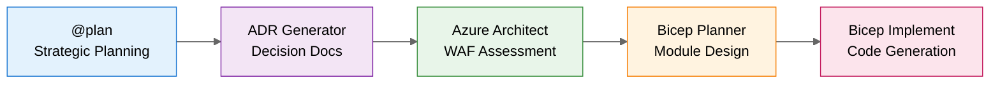
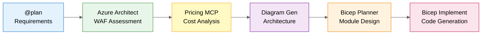

# Scenarios Overview

> **Version 3.1.0** | Last Updated: December 3, 2025
>
> **Hands-on learning scenarios demonstrating Agentic InfraOps as an efficiency multiplier for IT Professionals.**

---

## Quick Start

| If you're...                     | Start with                                              |
| -------------------------------- | ------------------------------------------------------- |
| **New to Copilot**               | [S01 Bicep Baseline](#s01-bicep-baseline)               |
| **Want a quick demo**            | [S11 Quick Demos](S11-quick-demos/) - 15-30 min prompts |
| **Experienced with IaC**         | [S03 Five-Agent Workflow](#s03-five-agent-workflow)     |
| **Full workflow demo**           | [S04 E-Commerce Platform](#s04-e-commerce-platform)     |
| **Focused on Terraform**         | [S02 Terraform Baseline](#s02-terraform-baseline)       |
| **Looking for async automation** | [S10 Coding Agent](#s10-coding-agent)                   |

---

## Quick Demos

For simple, single-prompt scenarios, see the [S11 Quick Demos](S11-quick-demos/) folder:

| Demo                                                       | Complexity      | Time   | Description                           |
| ---------------------------------------------------------- | --------------- | ------ | ------------------------------------- |
| [E-Commerce Prompts](S11-quick-demos/ecommerce-prompts.md) | 🟡 Intermediate | 30 min | PCI-DSS compliant multi-tier platform |
| [Healthcare Portal](S11-quick-demos/healthcare-demo.md)    | 🔴 Advanced     | 30 min | HIPAA-compliant patient portal        |
| [Analytics Platform](S11-quick-demos/analytics-demo.md)    | 🟡 Intermediate | 30 min | Data analytics with Synapse           |
| [Static Website](S11-quick-demos/static-site-demo.md)      | 🟢 Beginner     | 15 min | Simple static web app                 |

---

## Scenario Index

| #   | Scenario                                                  | Character       | Challenge                              | Time      | Difficulty   |
| --- | --------------------------------------------------------- | --------------- | -------------------------------------- | --------- | ------------ |
| S01 | [Bicep Baseline](#s01-bicep-baseline)                     | Elena Rodriguez | Build secure Azure network foundation  | 30 min    | Beginner     |
| S02 | [Terraform Baseline](#s02-terraform-baseline)             | Marcus Chen     | Multi-cloud IaC with Terraform         | 30 min    | Beginner     |
| S03 | [Five-Agent Workflow](#s03-five-agent-workflow)           | —               | End-to-end infrastructure design       | 45-60 min | Advanced     |
| S04 | [E-Commerce Platform](#s04-e-commerce-platform)           | —               | PCI-DSS compliant retail platform      | 60-90 min | Advanced     |
| S05 | [Documentation Generation](#s05-documentation-generation) | Elena Rodriguez | Auto-generate docs from code           | 20 min    | Beginner     |
| S06 | [Service Validation](#s06-service-validation)             | Marcus Thompson | Automated compliance testing           | 30 min    | Intermediate |
| S07 | [Troubleshooting](#s07-troubleshooting)                   | James Park      | Diagnose infrastructure issues         | 25 min    | Intermediate |
| S08 | [SBOM Generator](#s08-sbom-generator)                     | —               | Software Bill of Materials             | 20 min    | Intermediate |
| S09 | [Diagrams as Code](#s09-diagrams-as-code)                 | —               | Python-generated architecture diagrams | 20 min    | Beginner     |
| S10 | [Coding Agent](#s10-coding-agent)                         | Alex Petrov     | Async implementation via GitHub Issues | 30 min    | Advanced     |

---

## Scenario Details

### S01: Bicep Baseline

**[📁 View Scenario](S01-bicep-baseline/)**

> **Character**: Elena Rodriguez — Cloud Infrastructure Engineer with 10 years VMware experience, first Azure project

**Challenge**: Build a secure hub-spoke network foundation in 2 weeks with security requirements she's still learning.

**What You'll Learn**:

- Bicep fundamentals and Azure resource model
- Virtual Network concepts (mapped from VMware knowledge)
- Network Security Groups for microsegmentation
- Storage account security and private endpoints
- Module organization and parameter files

**Key Insight**: Copilot as a **learning partner** that maps existing skills to new platforms.

---

### S02: Terraform Baseline

**[📁 View Scenario](S02-terraform-baseline/)**

> **Character**: Marcus Chen — Senior Infrastructure Engineer with multi-cloud responsibilities

**Challenge**: Same hub-spoke topology as S01, but using Terraform for multi-cloud consistency.

**What You'll Learn**:

- HCL syntax and Terraform Azure Provider
- State management with Azure Storage backend
- Module patterns for reusable infrastructure
- Security scanning with tfsec and Checkov

**Key Insight**: Copilot accelerates Terraform development while maintaining multi-cloud portability.

---

### S03: Five-Agent Workflow

**[📁 View Scenario](S03-five-agent-workflow/)**

> **Production Example**: [`infra/bicep/contoso-patient-portal/`](../infra/bicep/contoso-patient-portal/) — 1,070 lines of Bicep, 10 modules

**Challenge**: Design and implement a HIPAA-compliant patient portal for Contoso Healthcare.

**The Five Agents**:



| Agent                       | Type     | Purpose                                |
| --------------------------- | -------- | -------------------------------------- |
| `@plan`                     | Built-in | Strategic planning with cost estimates |
| `adr_generator`             | Custom   | Document architectural decisions       |
| `azure-principal-architect` | Custom   | Azure WAF assessment                   |
| `bicep-plan`                | Custom   | Infrastructure module design           |
| `bicep-implement`           | Custom   | Generate production-ready Bicep        |

> **Note:** The Plan Agent (`@plan`) is a **built-in VS Code feature**—see [VS Code docs](https://code.visualstudio.com/docs/copilot/chat/chat-planning).
> The other four agents are custom agents defined in `.github/agents/`.

**Time Comparison**:

| Approach                 | Duration       |
| ------------------------ | -------------- |
| Traditional manual       | 18+ hours      |
| With Five-Agent Workflow | **45 minutes** |

**Key Insight**: Structured agent handoffs preserve context and produce near-production-ready code.

---

### S04: E-Commerce Platform

**[📁 View Scenario](S04-ecommerce-platform/)**

> **Production Example**: [`infra/bicep/ecommerce/`](../infra/bicep/ecommerce/) — Multi-tier retail platform with PCI-DSS compliance

**Challenge**: Design and deploy a production-ready e-commerce platform with payment processing requirements.

**The Complete Workflow**:



| Agent/Tool                  | Type     | Purpose                         |
| --------------------------- | -------- | ------------------------------- |
| `@plan`                     | Built-in | Strategic requirements planning |
| `azure-principal-architect` | Custom   | Azure WAF & PCI-DSS assessment  |
| Azure Pricing MCP           | MCP      | Real-time cost estimation       |
| `diagram-generator`         | Custom   | Python architecture diagrams    |
| `bicep-plan`                | Custom   | Infrastructure module design    |
| `bicep-implement`           | Custom   | Generate production-ready Bicep |

**Time Comparison**:

| Approach              | Duration       |
| --------------------- | -------------- |
| Traditional manual    | 24+ hours      |
| With Agentic Workflow | **60 minutes** |

**Key Insight**: Complete workflow demonstration from requirements to deployed infrastructure with real-time pricing.

---

### S05: Documentation Generation

**[📁 View Scenario](S05-documentation-generation/)**

> **Character**: Elena Rodriguez — Her infrastructure is deployed, but documentation is outdated

**Challenge**: Generate and maintain documentation that stays in sync with infrastructure code.

**What You'll Learn**:

- Auto-generate READMEs from Bicep/Terraform
- Create Mermaid architecture diagrams
- Build runbooks and operational guides
- Maintain consistency across documentation

**Key Insight**: Documentation as a **byproduct** of development, not a separate task.

---

### S06: Service Validation

**[📁 View Scenario](S06-service-validation/)**

> **Character**: Marcus Thompson — Cloud Architect preparing for Azure Advanced Specialization audit

**Challenge**: Verify 200+ compliance controls across infrastructure before auditors arrive.

**What You'll Learn**:

- PowerShell validation scripts with Pester
- Azure Policy compliance checking
- Automated audit evidence collection
- Pre-deployment validation patterns

**Key Insight**: Catch compliance gaps **before** auditors do.

---

### S07: Troubleshooting

**[📁 View Scenario](S07-troubleshooting/)**

> **Character**: James Park — Platform Engineer with production down and cryptic errors

**Challenge**: Diagnose and fix infrastructure issues under time pressure.

**What You'll Learn**:

- AI-assisted log analysis
- Azure Monitor and Log Analytics queries
- Root cause identification patterns
- Systematic debugging with Copilot

**Key Insight**: Minutes of AI-assisted diagnosis vs. hours of manual investigation.

---

### S08: SBOM Generator

**[📁 View Scenario](S08-sbom-generator/)**

**Challenge**: Generate Software Bill of Materials for compliance and security auditing.

**What You'll Learn**:

- SBOM generation with Syft
- Vulnerability scanning with Grype
- Container image analysis
- Compliance reporting formats

**Key Insight**: Automated security compliance without manual inventory.

---

### S09: Diagrams as Code

**[📁 View Scenario](S09-diagrams-as-code/)**

**Challenge**: Create Azure architecture diagrams that can be version-controlled and automated.

**What You'll Learn**:

- Python Diagrams library for Azure
- Architecture visualization patterns
- Diagram automation in CI/CD
- Consistent visual language

**Key Insight**: Diagrams that **never go stale** because they're generated from code.

---

### S10: Coding Agent

**[📁 View Scenario](S10-coding-agent/)**

> **Character**: Alex Petrov — Cloud Operations Engineer with 24 hours to add monitoring before go-live

**Challenge**: Implement monitoring infrastructure while handling other priorities.

**What You'll Learn**:

- GitHub Issue → Copilot assignment
- Autonomous codebase analysis
- Pull Request review workflow
- Async development patterns

**⚠️ Requirements**: GitHub Copilot Business/Enterprise with Coding Agent enabled

**Key Insight**: Delegate implementation to Copilot, focus on review and approval.

---

## Scenario Structure

Each scenario follows a consistent structure:

```
scenarios/SXX-scenario-name/
├── README.md              # Overview, character, learning objectives
├── DEMO-SCRIPT.md         # Step-by-step walkthrough with 🎓 Learning Moments
├── solution/              # Reference implementation
│   └── README.md          # Solution explanation
├── examples/              # Conversation transcripts
│   └── copilot-conversation.md
├── prompts/               # Effective prompts for this scenario
│   └── effective-prompts.md
└── validation/            # Post-completion validation
    └── validate.ps1
```

---

## Learning Paths

### Path 1: IaC Fundamentals (2 hours)

```
S01 Bicep Baseline → S05 Documentation → S06 Validation
```

Best for: IT Pros new to Infrastructure as Code

### Path 2: Advanced Workflow (4 hours)

```
S03 Five-Agent Workflow → S04 E-Commerce Platform → S09 Diagrams as Code
```

Best for: Architects and senior engineers

### Path 3: Multi-Cloud (2 hours)

```
S01 Bicep Baseline → S02 Terraform Baseline → Compare approaches
```

Best for: Teams evaluating IaC tools

### Path 4: Operations Focus (2 hours)

```
S06 Service Validation → S07 Troubleshooting → S08 SBOM Generator
```

Best for: DevOps and platform engineers

### Path 5: Complete Demo (3 hours)

```
S04 E-Commerce Platform → S09 Diagrams as Code → S10 Coding Agent
```

Best for: Live demonstrations and workshops

---

## Time Savings Summary

| Scenario                | Traditional | With Copilot | Savings |
| ----------------------- | ----------- | ------------ | ------- |
| S01 Bicep Baseline      | 4-6 hours   | 30 min       | 87-92%  |
| S02 Terraform Baseline  | 4-6 hours   | 30 min       | 87-92%  |
| S03 Five-Agent Workflow | 18+ hours   | 45 min       | 96%     |
| S04 E-Commerce Platform | 24+ hours   | 60 min       | 96%     |
| S05 Documentation       | 2-3 hours   | 20 min       | 85-89%  |
| S06 Service Validation  | 4-6 hours   | 30 min       | 87-92%  |
| S07 Troubleshooting     | 2-4 hours   | 25 min       | 79-90%  |

---

## Contributing

Want to add a new scenario? See [CONTRIBUTING.md](../CONTRIBUTING.md) for guidelines.

Each scenario should:

- Feature a relatable IT Pro character with a real challenge
- Include discovery-based learning (not just script generation)
- Provide measurable time savings
- Include validation scripts

---

## Document Info

|                |                            |
| -------------- | -------------------------- |
| **Created**    | November 2025              |
| **Updated**    | December 2025              |
| **Scenarios**  | 11 (S01-S10 + Quick Demos) |
| **Total Time** | ~7-8 hours (all scenarios) |
| **Maintainer** | Repository maintainers     |
