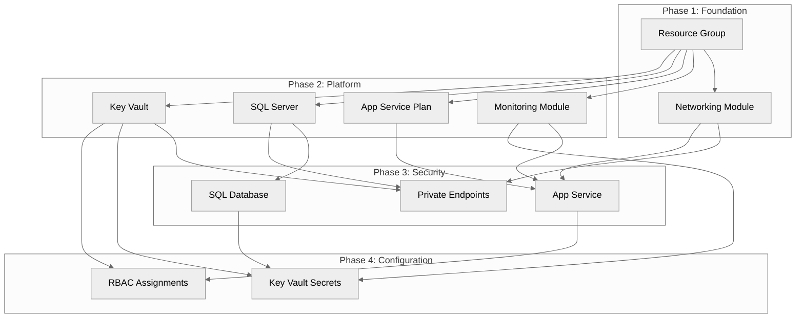

# Step 3: Bicep Planning Specialist

> **Agent Used:** `bicep-plan` > **Purpose:** Create machine-readable implementation plan for Bicep templates

---

## 💬 Prompt

```text
Create an implementation plan for the Contoso patient portal Bicep templates.

Resources to deploy:
- VNet with 3 subnets (web, data, private endpoints)
- NSG for each subnet
- Key Vault with private endpoint
- App Service Plan P1v3
- App Service with VNet integration and managed identity
- Azure SQL Server with Azure AD auth
- Azure SQL Database S1
- Private endpoints for SQL and Key Vault
- Log Analytics Workspace
- Application Insights
- RBAC role assignments

Use 4 deployment phases. Target scope: subscription.
```

---

## ✅ Implementation Plan

### Deployment Strategy

| Aspect  | Decision                                             |
| ------- | ---------------------------------------------------- |
| Scope   | Subscription (creates resource group)                |
| Phases  | 4 phases (Foundation → Platform → Security → Config) |
| Modules | 10 Bicep modules                                     |
| Region  | swedencentral (default)                              |
| Naming  | CAF convention with unique suffix                    |

---

## Resource Inventory

| #   | Resource Type           | Module Name             | Phase | Dependencies  |
| --- | ----------------------- | ----------------------- | ----- | ------------- |
| 1   | Resource Group          | main.bicep              | 1     | None          |
| 2   | Virtual Network         | networking.bicep        | 1     | RG            |
| 3   | Network Security Groups | networking.bicep        | 1     | RG            |
| 4   | Log Analytics Workspace | monitoring.bicep        | 2     | RG            |
| 5   | Application Insights    | monitoring.bicep        | 2     | Log Analytics |
| 6   | App Service Plan        | app-service-plan.bicep  | 2     | RG            |
| 7   | Azure SQL Server        | sql-server.bicep        | 2     | RG            |
| 8   | Key Vault               | key-vault.bicep         | 2     | RG            |
| 9   | Azure SQL Database      | sql-database.bicep      | 3     | SQL Server    |
| 10  | Private Endpoints       | private-endpoints.bicep | 3     | VNet, KV, SQL |
| 11  | App Service             | app-service.bicep       | 3     | ASP, VNet, MI |
| 12  | Key Vault Secrets       | key-vault-secrets.bicep | 4     | KV, SQL       |
| 13  | RBAC Assignments        | rbac-assignments.bicep  | 4     | KV, App Svc   |

---

## Dependency Diagram



---

## Module Specifications

### networking.bicep

```yaml
Purpose: VNet with subnets and NSGs
Inputs:
  - location: string
  - environment: string
  - projectName: string
  - uniqueSuffix: string
  - tags: object
Outputs:
  - vnetId: string
  - webSubnetId: string
  - dataSubnetId: string
  - privateEndpointSubnetId: string
Resources:
  - VNet: 10.0.0.0/16
  - snet-web: 10.0.1.0/24 (App Service delegation)
  - snet-data: 10.0.2.0/24 (service endpoints)
  - snet-pe: 10.0.3.0/24 (private endpoints)
  - NSG per subnet
```

### monitoring.bicep

```yaml
Purpose: Logging and application performance monitoring
Inputs:
  - location, environment, projectName, uniqueSuffix, tags
Outputs:
  - logAnalyticsWorkspaceId: string
  - applicationInsightsConnectionString: string
Resources:
  - Log Analytics Workspace (90-day retention)
  - Application Insights (workspace-based)
```

### app-service-plan.bicep

```yaml
Purpose: Hosting plan for App Service
Inputs:
  - location, environment, projectName, uniqueSuffix, tags
Outputs:
  - appServicePlanId: string
Resources:
  - App Service Plan (P1v3, Linux)
```

### sql-server.bicep

```yaml
Purpose: Azure SQL Server with Azure AD auth
Inputs:
  - location, environment, projectName, uniqueSuffix
  - sqlAdminUsername, sqlAdminPassword
  - azureAdAdminObjectId, azureAdAdminLogin
  - tags
Outputs:
  - sqlServerId: string
  - sqlServerName: string
  - fullyQualifiedDomainName: string
Resources:
  - SQL Server with Azure AD administrator
  - Firewall rule (allow Azure services)
```

### sql-database.bicep

```yaml
Purpose: Patient portal database
Inputs:
  - location, environment, uniqueSuffix
  - sqlServerName
  - tags
Outputs:
  - databaseId: string
  - databaseName: string
Resources:
  - SQL Database (S1, 20 DTU)
  - TDE enabled
```

### key-vault.bicep

```yaml
Purpose: Secrets and certificate management
Inputs:
  - location, environment, projectName, uniqueSuffix, tags
Outputs:
  - keyVaultId: string
  - keyVaultName: string
  - keyVaultUri: string
Resources:
  - Key Vault (Standard, soft-delete, RBAC)
```

### private-endpoints.bicep

```yaml
Purpose: Private connectivity for data services
Inputs:
  - location, environment, uniqueSuffix
  - keyVaultId, sqlServerId
  - privateEndpointSubnetId
  - tags
Outputs:
  - keyVaultPrivateEndpointId: string
  - sqlPrivateEndpointId: string
Resources:
  - Private endpoint for Key Vault
  - Private endpoint for SQL Server
  - Private DNS zones + links
```

### app-service.bicep

```yaml
Purpose: Patient portal web application
Inputs:
  - location, environment, projectName, uniqueSuffix
  - appServicePlanId, webSubnetId
  - applicationInsightsConnectionString
  - tags
Outputs:
  - appServiceId: string
  - appServicePrincipalId: string
  - defaultHostName: string
Resources:
  - App Service (Linux, .NET 8)
  - System-assigned managed identity
  - VNet integration
  - HTTPS only, TLS 1.2
```

### key-vault-secrets.bicep

```yaml
Purpose: Populate Key Vault with connection strings
Inputs:
  - keyVaultName
  - sqlConnectionString
  - applicationInsightsConnectionString
Resources:
  - Key Vault secrets (SQL, App Insights)
```

### rbac-assignments.bicep

```yaml
Purpose: Grant App Service access to Key Vault
Inputs:
  - keyVaultName
  - appServicePrincipalId
Resources:
  - Role assignment: Key Vault Secrets User
```

---

## Cost Estimation

| Resource               | SKU/Config       | Monthly Cost |
| ---------------------- | ---------------- | ------------ |
| App Service Plan       | P1v3 (Linux)     | $146.00      |
| Azure SQL Database     | S1 (20 DTU)      | $29.93       |
| Key Vault              | Standard         | $3.00        |
| Log Analytics          | 5 GB/month       | $12.42       |
| Application Insights   | Included with LA | $0.00        |
| Private Endpoints (×2) | $0.01/hour       | $14.60       |
| VNet + NSGs            | Free             | $0.00        |
| **Total**              |                  | **~$206**    |

---

## Testing Procedures

1. **Phase 1 Validation**

   - `bicep build modules/networking.bicep`
   - Verify subnet address spaces don't overlap

2. **Phase 2 Validation**

   - `bicep lint modules/sql-server.bicep`
   - Verify Azure AD admin configured correctly

3. **Phase 3 Validation**

   - Verify private endpoints resolve correctly
   - Test App Service can reach SQL via private endpoint

4. **Phase 4 Validation**
   - Verify secrets populated in Key Vault
   - Test App Service can read secrets

---

## ➡️ Next Step

Proceed to **`bicep-implement`** agent for Bicep template generation.
